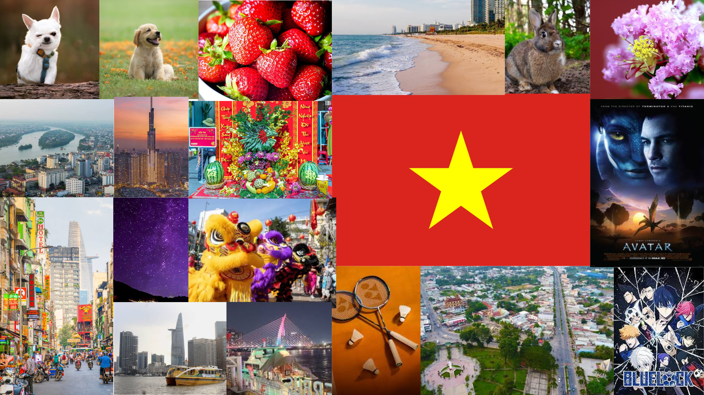

# me-in-markdown
## **Hi,**
 my name is *Vy*. I am in 9th grade. I came from Lawrence Middle school where I went for 3 years. My younger brother still goes to Lawrence.  My goal for this year is to do well in school.
 
One of my hobbies is playing badminton. My family and I go to the park to play badminton very often. Recently, I learned how to rollerskate. It took me about two days. During the summer I traveled to Vietnam with my family.

We stayed at Vietnam for 3 weeks and I got to visit many water parks. In Vietnam people wake up relaly early. I ate breakfast at 6 am and then went swimming. My family usually goes once every year or two. Also, in the future I hope I get into UCLA or UC Berkeley. 

[This is a link that will take you to Spotify.](https://open.spotify.com/playlist/1nhr7CvHQe8B96UiM7NkGM?si=90251bcf8cb8...)

Things I like

Things I need to do tomorrow: 

1. Wake up
2. Eat breakfast
3. Go to school
4. Do homework
5. Sleep and repeat